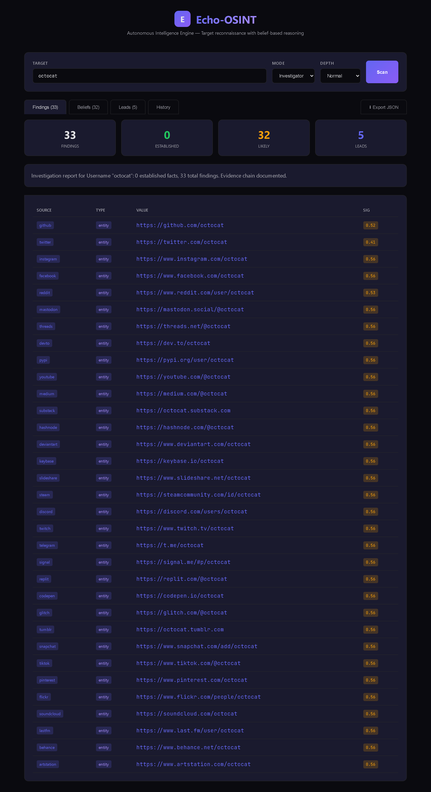

<div align="center">

# Echo-OSINT

### Autonomous Intelligence Engine

**Investigate a target. Evaluate the evidence. Surface what matters.**

[](LICENSE)
[](https://github.com/Jinish2170/Echo-OSINT/releases)
[](https://www.typescriptlang.org/)
[](https://nodejs.org)
[](https://react.dev)
[](https://expressjs.com)
[](#contributing)

[**Quick Start**](#-quick-start) · [**Features**](#-features) · [**API**](#-api) · [**Architecture**](#-architecture) · [**Roadmap**](#-roadmap)

</div>

---

## Overview

**Echo-OSINT** is a target-focused open-source intelligence engine. Hand it a username, domain, email, or IP — it runs deterministic reconnaissance against 50+ free sources, structures the results as evidence-backed *beliefs*, generates an intelligence brief, and proposes the next leads to chase.

Every confidence score traces back to a named source. Every belief carries its evidence chain. Every investigation persists for later resume, comparison, or export. **No black-box scoring, no LLM hallucinations, no paid API gates.**

```
SpiderFoot       → finds 500 entities, you sort what matters
Maltego          → manual transforms, manual graph
Echo-OSINT       → here are the 3 things that matter, here's the evidence, here's what to check next
```

---

## 📸 Dashboard

<div align="center">



*Live scan of `octocat` — 33 findings across 33 platforms (GitHub, Twitter, Instagram, Reddit, Mastodon, Threads, dev.to, PyPI, YouTube, Medium, Substack, Hashnode, DeviantArt, Keybase, SlideShare, Steam, Discord, Twitch, Telegram, Signal, Replit, CodePen, Glitch, Tumblr, Snapchat, TikTok, Pinterest, Flickr, SoundCloud, Last.fm, Behance, ArtStation, …) with significance scoring and 5 prioritized leads.*

</div>

---

## ✨ Features

| | |
|---|---|
| 🎯 **Target-aware recon** | Auto-detects whether input is a username, domain, email, or IP and dispatches the right modules |
| 👤 **Username enumeration** | Parallel checks across 50+ platforms — GitHub, GitLab, Mastodon, Reddit, Keybase, HackerOne, Steam, dev/social/gaming/finance |
| 🌐 **Domain reconnaissance** | RDAP/WHOIS, DNS-over-HTTPS (A / MX / NS / TXT), subdomain enumeration via crt.sh Certificate Transparency logs |
| 🧠 **Belief space reasoning** | Every finding becomes a `Belief` with status (`established` / `likely` / `uncertain`), confidence, and a full evidence trail |
| 📊 **Significance engine** | Multi-factor scoring — *novelty + rarity + severity + timeliness* — so you can audit *why* a finding ranks high |
| ⚡ **Contradiction detection** | Flags conflicting beliefs across sources instead of silently overwriting |
| 📋 **Intelligence briefs** | Auto-generated summary: established facts, likely assessments, prioritized leads, negative findings, contradictions |
| 💾 **Investigation persistence** | Every scan saves to `investigations/YYYY-MM-DD/` — resume, compare, export, version-control |
| 🖥 **Web dashboard** | React + Vite UI with Findings / Beliefs / Leads / History tabs and one-click JSON export |
| 🔌 **REST API** | Drop-in for automation pipelines, SOAR playbooks, or your own UI |
| 🆓 **Zero paid APIs** | Phase-1 capability ships fully on free sources — RDAP, DoH, crt.sh, public profile checks |

---

## 🎭 Three modes, three operators

| Mode | Built for | Question it answers |
|------|-----------|---------------------|
| 🔴 **Hunter** | Pentesters, bug-bounty hunters, red teams | *"What attack surface does this target expose?"* |
| 🔍 **Investigator** | Investigative journalists, corporate analysts, legal researchers | *"What connections and identities back this target?"* |
| 👁 **Watcher** | Threat-intel teams, SecOps, corporate monitoring | *"What's changed since the last scan?"* |

---

## 🚀 Quick Start

### Prerequisites

- **Node.js 20+**
- Git
- No paid API keys required for the default feature set

### Install & run

```bash
# 1. Clone
git clone https://github.com/Jinish2170/Echo-OSINT.git
cd Echo-OSINT

# 2. Install backend + frontend dependencies
npm install
cd frontend && npm install && cd ..

# 3. Start the API (:3001) and dashboard (:3000) together
npm run start:all
```

Open **http://localhost:3000**, enter a target, choose a mode, hit **Scan**.

### CLI alternative

```bash
npm run dev -- octocat investigator
npm run dev -- github.com hunter deep
npm run dev -- jane@example.com investigator
```

### REST alternative

```bash
npm run api    # backend only on :3001

curl -X POST http://localhost:3001/recon \
  -H "Content-Type: application/json" \
  -d '{"target":"octocat","mode":"investigator"}'
```

---

## 📡 API

| Method | Path | Purpose |
|--------|------|---------|
| `GET`  | `/health` | Liveness check |
| `POST` | `/recon` | Run a scan. Body: `{ target, mode?, depth? }`. Auto-persists. |
| `GET`  | `/investigations?limit=50` | List past investigations (most recent first) |
| `GET`  | `/investigation/:id` | Load a full past investigation by target ID |

### Request

```jsonc
POST /recon
{
  "target": "octocat",                  // required: username | domain | email | ip
  "mode":   "investigator",             // optional: hunter | investigator | watcher
  "depth":  "normal"                    // optional: quick | normal | deep
}
```

### Response

```jsonc
{
  "success": true,
  "target":      { "id": "tgt-...", "value": "octocat", "type": "username", "discoveredAt": "..." },
  "findings":    [ /* Finding[] — each with significance, evidence, source */ ],
  "beliefs":     [ /* Belief[] — derived from findings, with confidence + status */ ],
  "contradictions": [ /* detected conflicts between beliefs */ ],
  "brief": {
    "summary": "Investigated octocat (username) in investigator mode...",
    "establishedFacts":  [ /* high-confidence beliefs */ ],
    "likelyAssessments": [ /* mid-confidence beliefs */ ],
    "leads": [
      { "priority": "high", "description": "Cross-reference email at...", "rationale": "..." }
    ],
    "negativeFindings": [ "No presence on linkedin", "No presence on twitter" ]
  },
  "stats": {
    "totalFindings": 32,
    "establishedFacts": 0,
    "likelyAssessments": 31,
    "leads": 5,
    "negativeFindings": 1
  }
}
```

---

## 🏗 Architecture

```
echo-osint/
├── src/
│   ├── api/
│   │   └── server.ts                  Express API — /recon, /investigations
│   ├── core/
│   │   ├── http-client.ts             HTTP client (retry, TTL cache, concurrency)
│   │   ├── significance.ts            Multi-factor scoring engine
│   │   ├── belief-space.ts            Belief storage + contradiction detection
│   │   ├── brief-generator.ts         Intelligence brief synthesis
│   │   └── investigation-store.ts     File-based persistence layer
│   ├── recon/
│   │   ├── username.ts                50+ platform enumeration
│   │   └── domain.ts                  RDAP + DNS-over-HTTPS + crt.sh
│   ├── types/                         Shared types (Target, Finding, Belief, ...)
│   └── index.ts                       Programmatic entry + CLI
│
├── frontend/                          React + Vite dashboard
│   ├── src/App.tsx                    Main UI
│   └── src/App.css                    Dark theme
│
├── docs/                              Architecture & design docs
│   ├── design-product-definition.md
│   ├── design-final-architecture.md
│   └── design-intelligence-reasoning-engine.md
│
└── investigations/                    Auto-saved scan results (gitignored)
    └── YYYY-MM-DD/
        └── <target>__<id>.json
```

### Design principles

| Principle | What it means in practice |
|-----------|---------------------------|
| **Deterministic first** | Phase-1 ships zero LLM. Every score is reproducible. AI is an *optional* later enhancement. |
| **Evidence over claims** | Each finding carries its evidence chain (source, URL, reliability, timestamp). No magic numbers. |
| **Hypotheses over checklists** | The engine asks *"what could be true?"* and proposes leads, not just *"what should I check?"* |
| **Significance over volume** | 5 ranked findings beat 500 raw ones. The brief surfaces what matters. |
| **Transparent over magical** | Users can audit *how* every conclusion was reached. |

See [`docs/design-final-architecture.md`](docs/design-final-architecture.md) for the full design.

---

## 🛠 Commands

| Command | Description |
|---------|-------------|
| `npm run start:all`     | API on `:3001` **and** dashboard dev server on `:3000` (recommended) |
| `npm run api`           | Backend API only |
| `npm run frontend:dev`  | Dashboard dev server only |
| `npm run dev -- <target> [mode] [depth]` | Headless CLI scan |
| `npm run build`         | Compile backend TypeScript to `dist/` |
| `npm run frontend`      | Build production dashboard bundle |
| `npm run typecheck`     | TypeScript check, no emit |
| `npm run lint`          | ESLint over `src/` |
| `npm test`              | Jest tests |

---

## 🗺 Roadmap

- [x] **v0.2** — Deterministic recon engine, belief space, dashboard, investigation persistence
- [ ] **v0.3** — Email recon (HIBP), infrastructure recon (Shodan / Censys), probabilistic identity resolver
- [ ] **v0.4** — Optional AI enhancement layer (NVIDIA NIM, structured JSON output) for pivot suggestions and report enrichment
- [ ] **v0.5** — **Echo signal tracking**: temporal propagation across platforms, velocity calculation, amplification detection — the unique differentiator no existing tool offers
- [ ] **v1.0** — Production-grade autonomous intelligence engine with monitoring, scheduled scans, and alert pipelines

Full vision: [`docs/design-product-definition.md`](docs/design-product-definition.md).

---

## 🆚 How it compares

| | Echo-OSINT | SpiderFoot | Maltego | Manual OSINT |
|---|:---:|:---:|:---:|:---:|
| Target-aware dispatching | ✅ | ⚠️ | ❌ | ❌ |
| Evidence-traced confidence | ✅ | ❌ | ⚠️ | ❌ |
| Auto-generated brief & leads | ✅ | ❌ | ❌ | ❌ |
| Investigation persistence | ✅ | ⚠️ | ✅ | ❌ |
| Web dashboard out of the box | ✅ | ✅ | ✅ | ❌ |
| 100% free data sources (Phase 1) | ✅ | ⚠️ | ❌ | — |
| Open source | ✅ | ✅ | ❌ | — |

---

## 🤝 Contributing

Contributions, issues, and feature requests are welcome.

1. Fork the repo
2. `git checkout -b feature/my-feature`
3. Commit your changes with a clear message
4. Run `npm run typecheck && npm run lint && npm test`
5. Open a pull request against `master`

Good first issues:
- Add a new recon module (Shodan, HIBP, Censys, GitHub-org enumeration)
- Add visualizations to the dashboard (timeline, force-graph for relationships)
- Improve significance scoring with platform-specific weights
- Write tests for `core/belief-space.ts` and `core/significance.ts`

---

## ⚠️ Legal & Ethics

Echo-OSINT is built for **authorized security testing, investigative journalism, threat intelligence, and academic research**.

You are responsible for:
- Respecting platform Terms of Service and `robots.txt`
- Honoring published rate limits
- Complying with applicable laws (GDPR, CFAA, local privacy law, etc.)
- Verifying critical findings through primary sources

The authors disclaim liability for misuse. **Use it on targets you are authorized to investigate.**

---

## 📄 License

MIT © [Jinish Dhola](https://github.com/Jinish2170) — see [LICENSE](LICENSE).

---

<div align="center">

**Built with TypeScript, Express, and React.**

[⭐ Star on GitHub](https://github.com/Jinish2170/Echo-OSINT) · [🐛 Report an issue](https://github.com/Jinish2170/Echo-OSINT/issues) · [💬 Discussions](https://github.com/Jinish2170/Echo-OSINT/discussions)

</div>
